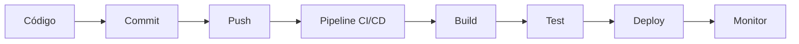

# 1.1 Introducción a GitLab

## ¿Qué es GitLab?

GitLab es una plataforma DevOps completa que proporciona un conjunto de herramientas para el desarrollo de software, desde la planificación hasta el monitoreo. A diferencia de otras herramientas que se enfocan en una sola función, GitLab ofrece una solución integral.

## 🔍 Características principales

### Control de versiones
- Repositorios Git integrados
- Interfaz web intuitiva
- Revisión de código colaborativa
- Merge requests avanzados

### CI/CD Integrado
- Pipelines automáticos
- Despliegues continuos
- Testing automatizado
- Monitoreo de aplicaciones

### Gestión de proyectos
- Issues y milestones
- Boards estilo Kanban
- Wikis de documentación
- Time tracking

## 🆚 GitLab vs GitHub vs Bitbucket

| Característica | GitLab | GitHub | Bitbucket |
|---|---|---|---|
| **CI/CD Nativo** | ✅ Incluido | ❌ GitHub Actions separado | ❌ Pipelines separado |
| **Auto DevOps** | ✅ | ❌ | ❌ |
| **Hosting propio** | ✅ Community Edition gratuita | ❌ Solo Enterprise | ✅ Server |
| **Gestión de proyectos** | ✅ Completa | ⚠️ Básica | ⚠️ Básica |
| **Container Registry** | ✅ | ✅ | ✅ |

## 🏗️ Arquitectura de GitLab

```
┌─────────────────────────────────────────────────┐
│                   GitLab                        │
├─────────────────────────────────────────────────┤
│  Web Interface │ Git Repository │ Wiki │ Issues │
├─────────────────────────────────────────────────┤
│              GitLab CI/CD                       │
├─────────────────────────────────────────────────┤
│  GitLab Runner │ Registry │ Monitoring │ K8s    │
└─────────────────────────────────────────────────┘
```

## 🚀 Ventajas de GitLab CI/CD

### 1. **Integración Nativa**
- No necesitas configurar herramientas externas
- Todo está en un solo lugar
- Configuración simplificada

### 2. **Auto DevOps**
- Detección automática de aplicaciones
- Pipelines predefinidos
- Despliegue automático en Kubernetes

### 3. **Escalabilidad**
- Runners distribuidos
- Paralelización automática
- Recursos dinámicos

### 4. **Seguridad**
- Escaneo de vulnerabilidades integrado
- SAST/DAST automático
- Dependency scanning

## 📊 Flujo de trabajo típico



## 🔧 Casos de uso comunes

### Desarrollo de aplicaciones web
- Frontend: React, Vue, Angular
- Backend: Node.js, Python, Java
- Base de datos: PostgreSQL, MongoDB

### DevOps y microservicios
- Containerización con Docker
- Orquestación con Kubernetes
- Monitoreo con Prometheus

### Mobile development
- Apps nativas iOS/Android
- React Native, Flutter
- Testing en múltiples dispositivos

## 💡 Conceptos clave que aprenderás

1. **Repository**: Donde vive tu código
2. **Pipeline**: Serie de pasos automatizados
3. **Runner**: Ejecutor de los pipelines
4. **Job**: Tarea individual en el pipeline
5. **Stage**: Grupo de jobs que se ejecutan en paralelo
6. **Artifact**: Archivos generados por jobs
7. **Variable**: Configuración reutilizable

## 🎯 ¿Por qué elegir GitLab?

### Para startups
- Gratis hasta 5 usuarios
- Todas las funcionalidades incluidas
- Fácil de escalar

### Para empresas
- Hosting propio disponible
- Cumplimiento de seguridad
- Soporte empresarial

### Para desarrolladores
- Interfaz intuitiva
- Documentación excelente
- Comunidad activa

## 📝 Ejercicio práctico

### Objetivo
Explorar la interfaz de GitLab y familiarizarse con los conceptos básicos.

### Pasos
1. Ve a [gitlab.com](https://gitlab.com)
2. Crea una cuenta gratuita
3. Explora los siguientes proyectos públicos:
   - [GitLab CE](https://gitlab.com/gitlab-org/gitlab)
   - [Auto DevOps](https://gitlab.com/gitlab-examples/auto-devops-example)
4. Observa los pipelines en ejecución
5. Revisa los merge requests

### Preguntas para reflexionar
- ¿Qué diferencias notas con otras plataformas?
- ¿Qué te parece más intuitivo?
- ¿Qué funcionalidades te llaman más la atención?

---

**Siguiente:** [1.2 Configuración inicial de proyecto](./02-setup-proyecto.md)

## 📚 Recursos adicionales

- [Documentación oficial de GitLab](https://docs.gitlab.com/)
- [GitLab Learn](https://about.gitlab.com/learn/)
- [Comunidad GitLab](https://forum.gitlab.com/)
- [GitLab YouTube Channel](https://www.youtube.com/channel/UCnMGQ8QHMAnVIsI3xJrihhg)