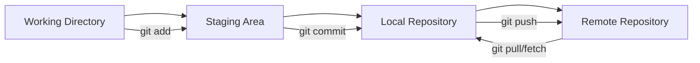

# 1.3 Operaciones básicas con Git

## 🎯 Objetivo
Dominar las operaciones fundamentales de Git que son esenciales para trabajar efectivamente con GitLab CI/CD.

## 🔄 Flujo básico de trabajo

### El ciclo de desarrollo típico


## 📝 Comandos fundamentales

### Configuración inicial
```bash
# Configurar identidad
git config --global user.name "Tu Nombre"
git config --global user.email "tu.email@ejemplo.com"

# Configurar editor por defecto
git config --global core.editor "code --wait"  # VS Code
git config --global core.editor "vim"          # Vim

# Configurar rama por defecto
git config --global init.defaultBranch main

# Ver configuración actual
git config --list
```

### Estados de archivos en Git

```bash
# Ver estado actual
git status

# Ver estado resumido
git status -s

# Ver diferencias
git diff                    # Working directory vs Staging
git diff --cached          # Staging vs Last commit
git diff HEAD              # Working directory vs Last commit
```

## 🔧 Operaciones básicas paso a paso

### 1. Clonar repositorio
```bash
# Clonar via HTTPS
git clone https://gitlab.com/usuario/proyecto.git

# Clonar via SSH (recomendado)
git clone git@gitlab.com:usuario/proyecto.git

# Clonar en directorio específico
git clone git@gitlab.com:usuario/proyecto.git mi-proyecto

# Clonar rama específica
git clone -b feature/nueva-funcionalidad git@gitlab.com:usuario/proyecto.git
```

### 2. Trabajar con cambios
```bash
# Añadir archivos al staging
git add archivo.js                # Archivo específico
git add *.js                     # Todos los .js
git add .                        # Todos los archivos
git add -A                       # Todos los archivos (incluyendo eliminados)

# Eliminar del staging
git reset archivo.js             # Quitar archivo del staging
git reset                        # Quitar todos los archivos del staging

# Descartar cambios
git checkout -- archivo.js      # Descartar cambios en archivo
git checkout -- .               # Descartar todos los cambios
```

### 3. Commits efectivos
```bash
# Commit simple
git commit -m "Mensaje descriptivo"

# Commit con descripción extendida
git commit -m "Título del commit

Descripción más detallada de los cambios realizados.
- Cambio 1
- Cambio 2"

# Commit añadiendo archivos modificados automáticamente
git commit -am "Actualizar archivos existentes"

# Modificar último commit
git commit --amend -m "Nuevo mensaje"
```

## 📏 Convenciones para mensajes de commit

### Formato recomendado (Conventional Commits)
```
<tipo>[ámbito opcional]: <descripción>

[cuerpo opcional]

[pie opcional]
```

### Tipos de commit
```bash
feat: nueva funcionalidad
fix: corrección de bug
docs: cambios en documentación
style: cambios de formato (no afectan funcionalidad)
refactor: refactorización de código
test: añadir o modificar tests
chore: tareas de mantenimiento
```

### Ejemplos prácticos
```bash
git commit -m "feat: añadir autenticación de usuarios"
git commit -m "fix: corregir error en cálculo de precios"
git commit -m "docs: actualizar README con instrucciones de instalación"
git commit -m "style: formatear código según estándares del proyecto"
git commit -m "refactor: extraer lógica de validación a función separada"
git commit -m "test: añadir tests para módulo de pagos"
git commit -m "chore: actualizar dependencias del proyecto"
```

## 🌿 Trabajo con ramas

### Operaciones básicas con ramas
```bash
# Ver ramas locales
git branch

# Ver todas las ramas (locales y remotas)
git branch -a

# Crear nueva rama
git branch feature/nueva-funcionalidad

# Cambiar a rama
git checkout feature/nueva-funcionalidad

# Crear y cambiar a nueva rama
git checkout -b feature/nueva-funcionalidad

# Cambiar nombre de rama actual
git branch -m nuevo-nombre

# Eliminar rama local
git branch -d feature/rama-terminada
git branch -D feature/rama-forzar-eliminacion  # Forzar eliminación
```

### Trabajo con ramas remotas
```bash
# Ver ramas remotas
git branch -r

# Hacer push de nueva rama
git push -u origin feature/nueva-funcionalidad

# Eliminar rama remota
git push origin --delete feature/rama-terminada

# Sincronizar ramas remotas
git fetch --prune
```

## 🔄 Sincronización con remoto

### Operaciones de sincronización
```bash
# Descargar cambios sin aplicar
git fetch

# Descargar y aplicar cambios
git pull

# Hacer push de commits
git push

# Push forzado (usar con cuidado)
git push --force-with-lease

# Ver información del remoto
git remote -v
git remote show origin
```

### Resolver conflictos
```bash
# Cuando hay conflictos en pull
git pull  # Se producen conflictos

# Editar archivos para resolver conflictos
# Los conflictos se marcan así:
# <<<<<<< HEAD
# Contenido local
# =======
# Contenido remoto
# >>>>>>> rama-remota

# Después de resolver
git add archivos-resueltos
git commit -m "resolve: merge conflicts"
```

## 📊 Visualización del historial

### Ver historial de commits
```bash
# Historial básico
git log

# Historial resumido
git log --oneline

# Historial con gráfico
git log --oneline --graph --all

# Historial con estadísticas
git log --stat

# Historial de un archivo específico
git log -- archivo.js

# Historial entre fechas
git log --since="2023-01-01" --until="2023-12-31"
```

### Ver cambios específicos
```bash
# Ver cambios en commit específico
git show 1a2b3c4

# Ver cambios en archivo específico
git show 1a2b3c4 -- archivo.js

# Comparar ramas
git diff main..feature/nueva-funcionalidad

# Comparar commits
git diff 1a2b3c4..5e6f7g8
```

## 🏷️ Trabajo con tags

### Crear y gestionar tags
```bash
# Crear tag anotado (recomendado)
git tag -a v1.0.0 -m "Versión 1.0.0 - Primera release"

# Crear tag ligero
git tag v1.0.0

# Ver tags
git tag
git tag -l "v1.*"

# Hacer push de tags
git push origin v1.0.0        # Tag específico
git push origin --tags        # Todos los tags

# Eliminar tag
git tag -d v1.0.0             # Local
git push origin --delete v1.0.0  # Remoto
```

## 🛠️ Herramientas útiles

### Alias de Git
```bash
# Configurar aliases útiles
git config --global alias.st status
git config --global alias.co checkout
git config --global alias.br branch
git config --global alias.ci commit
git config --global alias.unstage 'reset HEAD --'
git config --global alias.last 'log -1 HEAD'
git config --global alias.visual '!gitk'

# Alias avanzados
git config --global alias.lg "log --color --graph --pretty=format:'%Cred%h%Creset -%C(yellow)%d%Creset %s %Cgreen(%cr) %C(bold blue)<%an>%Creset' --abbrev-commit"
```

### .gitconfig ejemplo
```ini
[user]
    name = Tu Nombre
    email = tu.email@ejemplo.com

[core]
    editor = code --wait
    autocrlf = input

[init]
    defaultBranch = main

[alias]
    st = status
    co = checkout
    br = branch
    ci = commit
    lg = log --color --graph --pretty=format:'%Cred%h%Creset -%C(yellow)%d%Creset %s %Cgreen(%cr) %C(bold blue)<%an>%Creset' --abbrev-commit

[push]
    default = current

[pull]
    rebase = false
```

## 🎯 Flujo de trabajo recomendado para GitLab

### Feature Branch Workflow
```bash
# 1. Actualizar main
git checkout main
git pull origin main

# 2. Crear rama para nueva funcionalidad
git checkout -b feature/login-usuario

# 3. Trabajar en la funcionalidad
# ... hacer cambios ...
git add .
git commit -m "feat: implementar formulario de login"

# 4. Más cambios si es necesario
# ... más cambios ...
git commit -m "feat: añadir validación de email"

# 5. Push de la rama
git push -u origin feature/login-usuario

# 6. Crear Merge Request en GitLab
# (desde la interfaz web)

# 7. Después del merge, limpiar
git checkout main
git pull origin main
git branch -d feature/login-usuario
```

## 🔍 Comandos para debugging

### Encontrar problemas
```bash
# Buscar en el historial
git log --grep="login"        # Buscar commits que mencionen "login"
git log -S "función"          # Buscar commits que añadan/eliminen "función"

# Git blame - ver quién cambió qué
git blame archivo.js

# Git bisect - encontrar commit que introdujo bug
git bisect start
git bisect bad                # Commit actual tiene el bug
git bisect good 1a2b3c4      # Este commit estaba bien
# Git te guiará para encontrar el commit problemático
```

## 💡 Consejos y buenas prácticas

### Commits
- ✅ Hacer commits pequeños y frecuentes
- ✅ Usar mensajes descriptivos
- ✅ Un commit = una funcionalidad/fix
- ❌ No hacer commits de archivos generados (build, logs, etc.)

### Ramas
- ✅ Usar nombres descriptivos: `feature/`, `bugfix/`, `hotfix/`
- ✅ Mantener ramas actualizadas con main
- ✅ Eliminar ramas después del merge
- ❌ No trabajar directamente en main/master

### Sincronización
- ✅ Hacer pull antes de push
- ✅ Resolver conflictos localmente
- ✅ Hacer push frecuentemente
- ❌ No usar `--force` sin `--force-with-lease`

## 🎯 Ejercicio práctico

### Objetivo
Practicar el flujo completo de trabajo con Git y GitLab.

### Pasos a seguir
1. **Configurar repositorio**
   ```bash
   git clone tu-repositorio-del-ejercicio-anterior
   cd tu-repositorio
   ```

2. **Crear y trabajar en feature branch**
   ```bash
   git checkout -b feature/mejoras-readme
   # Editar README.md con nueva información
   git add README.md
   git commit -m "docs: mejorar documentación del README"
   git push -u origin feature/mejoras-readme
   ```

3. **Simular más desarrollo**
   ```bash
   # Crear archivo nuevo
   echo "console.log('Hello World!');" > src/hello.js
   git add src/hello.js
   git commit -m "feat: añadir script de saludo"
   
   # Modificar archivo existente
   echo "# Changelog\n\n## v1.0.1\n- Mejorada documentación" > CHANGELOG.md
   git add CHANGELOG.md
   git commit -m "docs: añadir archivo de changelog"
   
   git push origin feature/mejoras-readme
   ```

4. **Crear Merge Request en GitLab**
   - Ve a tu proyecto en GitLab
   - Verás una sugerencia para crear MR
   - Añade descripción detallada
   - Asigna reviewers si es necesario

5. **Simular revisión y merge**
   - Revisa los cambios en la interfaz
   - Añade comentarios si es necesario
   - Aprueba y haz merge

6. **Limpiar después del merge**
   ```bash
   git checkout main
   git pull origin main
   git branch -d feature/mejoras-readme
   ```

---

**Anterior:** [1.2 Configuración inicial de proyecto](./02-setup-proyecto.md)  
**Siguiente:** [2.1 ¿Qué es GitLab Runner?](../parte2-runner/01-que-es-runner.md)

## 📚 Recursos adicionales

- [Pro Git Book](https://git-scm.com/book)
- [Git Cheat Sheet](https://education.github.com/git-cheat-sheet-education.pdf)
- [Conventional Commits](https://www.conventionalcommits.org/)
- [GitLab Flow](https://docs.gitlab.com/ee/topics/gitlab_flow.html)