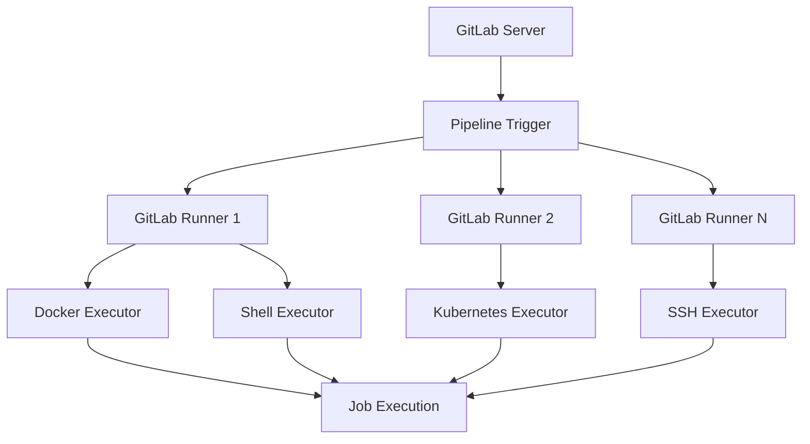

# 2.1 ¿Qué es GitLab Runner?

## 🎯 Objetivo
Entender qué es GitLab Runner, cómo funciona y por qué es fundamental para implementar CI/CD en GitLab.

## 🤖 ¿Qué es GitLab Runner?

GitLab Runner es una aplicación open source escrita en Go que ejecuta los jobs de tus pipelines CI/CD. Es el componente que realmente ejecuta el código definido en tu archivo `.gitlab-ci.yml`.

### Conceptos clave
- **Runner**: La aplicación que ejecuta los jobs
- **Executor**: El entorno donde se ejecutan los jobs (Docker, Shell, etc.)
- **Job**: Una tarea individual dentro de un pipeline
- **Pipeline**: Conjunto de jobs organizados en stages

## 🏗️ Arquitectura de GitLab CI/CD



## 🔄 Flujo de ejecución

### 1. Trigger del Pipeline
```yaml
# .gitlab-ci.yml
stages:
  - build
  - test
  - deploy

build_job:
  stage: build
  script:
    - echo "Building application..."
```

### 2. Asignación de Jobs
1. GitLab Server detecta cambios en el repositorio
2. Procesa el archivo `.gitlab-ci.yml`
3. Crea jobs según la configuración
4. Busca runners disponibles con las tags apropiadas

### 3. Ejecución del Job
1. Runner toma el job de la cola
2. Prepara el entorno (pull de imagen, setup, etc.)
3. Ejecuta los scripts definidos
4. Reporta resultados a GitLab Server

## 🏷️ Tipos de Runners

### Shared Runners
- **Descripción**: Disponibles para todos los proyectos en GitLab.com
- **Ventajas**: Fácil configuración, mantenidos por GitLab
- **Limitaciones**: Tiempo limitado, recursos compartidos

```yaml
# Se usan automáticamente si no especificas tags
build_job:
  script:
    - echo "Usando shared runner"
```

### Group Runners
- **Descripción**: Disponibles para todos los proyectos de un grupo
- **Ventajas**: Compartidos entre proyectos relacionados
- **Gestión**: Administrados a nivel de grupo

### Project Runners (Specific Runners)
- **Descripción**: Dedicados a un proyecto específico
- **Ventajas**: Control total, recursos dedicados
- **Uso**: Proyectos con necesidades específicas

```yaml
# Usando runner específico con tags
deploy_job:
  tags:
    - production
    - docker
  script:
    - ./deploy.sh
```

## ⚙️ Tipos de Ejecutores

### Docker Executor (Recomendado)
- **Ventajas**: Aislamiento, reproducibilidad, flexibilidad
- **Uso**: La mayoría de casos de uso
- **Configuración**: Cada job corre en un contenedor nuevo

```yaml
build_docker:
  image: node:16
  script:
    - npm install
    - npm run build
```

### Shell Executor
- **Ventajas**: Acceso directo al sistema host
- **Desventajas**: Menos aislamiento
- **Uso**: Casos específicos que requieren acceso al host

```yaml
build_shell:
  tags:
    - shell
  script:
    - ./build_script.sh
```

### Kubernetes Executor
- **Ventajas**: Escalabilidad automática, recursos dinámicos
- **Uso**: Entornos empresariales con Kubernetes
- **Configuración**: Jobs ejecutados como pods

### SSH Executor
- **Ventajas**: Ejecutar en máquinas remotas
- **Uso**: Despliegues en servidores específicos
- **Configuración**: Conexión SSH a máquinas target

### VirtualBox/Parallels Executor
- **Ventajas**: Máquinas virtuales completas
- **Uso**: Testing en diferentes sistemas operativos
- **Desventajas**: Mayor overhead de recursos

## 🔧 Instalación y registro básico

### En Ubuntu/Debian
```bash
# Añadir repositorio oficial
curl -L "https://packages.gitlab.com/install/repositories/runner/gitlab-runner/script.deb.sh" | sudo bash

# Instalar GitLab Runner
sudo apt-get install gitlab-runner

# Verificar instalación
gitlab-runner --version
```

### En macOS
```bash
# Descargar binario
sudo curl --output /usr/local/bin/gitlab-runner "https://gitlab-runner-downloads.s3.amazonaws.com/latest/binaries/gitlab-runner-darwin-amd64"

# Dar permisos de ejecución
sudo chmod +x /usr/local/bin/gitlab-runner

# Verificar instalación
gitlab-runner --version
```

### Registro básico
```bash
# Registrar runner
sudo gitlab-runner register

# Se te pedirá:
# - GitLab instance URL: https://gitlab.com/
# - Registration token: (obtener de Settings > CI/CD > Runners)
# - Description: Mi primer runner
# - Tags: docker,linux
# - Executor: docker
# - Default Docker image: ubuntu:20.04
```

## 📊 Estados de un Runner

### Estados posibles
- **Active**: Runner disponible para ejecutar jobs
- **Paused**: Runner pausado manualmente
- **Offline**: Runner no se ha comunicado recientemente
- **Not connected**: Runner nunca se ha conectado

### Monitoreo
```bash
# Ver estado de runners
gitlab-runner status

# Ver logs
gitlab-runner --debug run

# Verificar configuración
gitlab-runner verify
```

## 🏃‍♂️ Runners en GitLab.com vs Self-hosted

### GitLab.com (Shared Runners)
```yaml
# Límites por defecto en GitLab.com
- 400 minutos CI/CD por mes (plan gratuito)
- 2000 minutos CI/CD por mes (plan premium)
- Máximo 1 job concurrente (plan gratuito)
```

### Self-hosted Runners
```yaml
# Ventajas de runners propios
- Sin límites de tiempo
- Control total de recursos
- Configuración personalizada
- Acceso a recursos internos
```

## 🎯 Cuándo usar cada tipo

### Usa Shared Runners cuando:
- ✅ Proyecto simple sin necesidades especiales
- ✅ Equipo pequeño con pocas builds
- ✅ No necesitas software específico
- ✅ Estás empezando con CI/CD

### Usa Project Runners cuando:
- ✅ Necesitas software específico instalado
- ✅ Requieres acceso a recursos internos
- ✅ Tienes requisitos de seguridad estrictos
- ✅ Necesitas builds largas o muchas builds concurrentes

### Usa Group Runners cuando:
- ✅ Múltiples proyectos relacionados
- ✅ Quieres compartir configuración entre proyectos
- ✅ Necesitas optimizar recursos
- ✅ Gestión centralizada de runners

## 🔐 Consideraciones de seguridad

### Shared Runners
```yaml
# Limitaciones de seguridad
- No acceso a redes internas
- Entorno compartido con otros usuarios
- Recursos limitados
- No software personalizado
```

### Self-hosted Runners
```yaml
# Consideraciones importantes
- Mantener runners actualizados
- Configurar firewall apropiadamente
- Usar Docker para aislamiento
- Rotar tokens regularmente
- Monitorear acceso y uso
```

## 📈 Escalabilidad y rendimiento

### Configuración para alta carga
```toml
# config.toml
concurrent = 10  # Número de jobs simultáneos

[[runners]]
  # ... configuración del runner
  limit = 5      # Límite para este runner específico
```

### Autoscaling con Docker Machine
```toml
[[runners]]
  name = "docker-machine"
  url = "https://gitlab.com/"
  token = "TOKEN"
  executor = "docker+machine"
  [runners.docker]
    image = "alpine"
  [runners.machine]
    IdleCount = 1
    IdleTime = 1800
    MaxBuilds = 10
    MachineDriver = "amazonec2"
    MachineName = "gitlab-docker-machine-%s"
    MachineOptions = [
      "amazonec2-access-key=AKIAI6ODT8EXAMPLE",
      "amazonec2-secret-key=wJalrXUtnFEMI/K7MDENG/bPxRfiCYEXAMPLEKEY",
      "amazonec2-region=us-west-2",
      "amazonec2-vpc-id=vpc-12345678",
      "amazonec2-subnet-id=subnet-12345678",
      "amazonec2-instance-type=m4.large"
    ]
```

## 🎯 Ejercicio práctico

### Objetivo
Entender los diferentes tipos de runners y sus casos de uso.

### Pasos
1. **Explorar Shared Runners**
   - Ve a tu proyecto en GitLab
   - Settings > CI/CD > Runners
   - Observa los shared runners disponibles

2. **Analizar configuración**
   ```yaml
   # Crear archivo .gitlab-ci.yml de prueba
   test_shared_runner:
     script:
       - echo "Ejecutándose en shared runner"
       - whoami
       - pwd
       - cat /etc/os-release
   ```

3. **Commit y observar ejecución**
   ```bash
   git add .gitlab-ci.yml
   git commit -m "ci: añadir pipeline de prueba"
   git push origin main
   ```

4. **Analizar logs de ejecución**
   - Ve a CI/CD > Pipelines
   - Clic en el pipeline ejecutado
   - Revisa los logs del job
   - Observa información del runner utilizado

### Preguntas para reflexionar
- ¿Qué información puedes obtener sobre el runner usado?
- ¿Qué sistema operativo está ejecutando el job?
- ¿Cuánto tiempo tardó en ejecutarse?
- ¿Qué limitaciones observas?

## 🔍 Debugging de Runners

### Comandos útiles
```bash
# Ver runners registrados
gitlab-runner list

# Verificar conectividad
gitlab-runner verify

# Ejecutar en modo debug
gitlab-runner --debug run

# Ver logs detallados
journalctl -u gitlab-runner -f
```

### Problemas comunes
1. **Runner offline**: Verificar conectividad de red
2. **Jobs pendientes**: Verificar tags y disponibilidad
3. **Errores de permisos**: Verificar configuración de usuario
4. **Falta de recursos**: Monitorear CPU y memoria

---

**Anterior:** [1.3 Operaciones básicas con Git](../parte1-fundamentos/03-git-basico.md)  
**Siguiente:** [2.2 Instalación de GitLab Runner](./02-instalacion-runner.md)

## 📚 Recursos adicionales

- [GitLab Runner Documentation](https://docs.gitlab.com/runner/)
- [GitLab Runner Executors](https://docs.gitlab.com/runner/executors/)
- [Runner Security](https://docs.gitlab.com/runner/security/)
- [Troubleshooting Runners](https://docs.gitlab.com/runner/faq/)