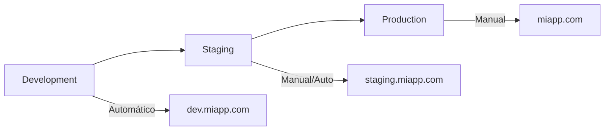

# 5.1 Multi-ambiente (dev, staging, prod)

## 🎯 Objetivo
Implementar estrategias de despliegue en múltiples ambientes con GitLab CI/CD, incluyendo promoción automática y manual entre entornos.

## 🌍 Arquitectura de ambientes típica



### Características por ambiente

| Ambiente | Propósito | Despliegue | Datos | Monitoreo |
|----------|-----------|------------|-------|-----------|
| **Development** | Desarrollo activo | Automático en push | Datos de prueba | Logs básicos |
| **Staging** | Pre-producción | Automático en merge | Datos similares a prod | Monitoreo completo |
| **Production** | Usuarios reales | Manual con aprobación | Datos reales | Monitoreo crítico |

## 🏗️ Configuración de ambientes en GitLab

### Definir ambientes en GitLab UI
```
Project > Deployments > Environments

Environments:
- development (auto-deploy)
- staging (auto-deploy)
- production (manual deploy)
```

### Variables por ambiente
```yaml
# Settings > CI/CD > Variables

# Development
DATABASE_URL: "postgres://dev-db:5432/app_dev" (scope: development)
API_URL: "https://dev-api.example.com" (scope: development)
LOG_LEVEL: "debug" (scope: development)

# Staging  
DATABASE_URL: "postgres://staging-db:5432/app_staging" (scope: staging)
API_URL: "https://staging-api.example.com" (scope: staging)
LOG_LEVEL: "info" (scope: staging)

# Production
DATABASE_URL: "postgres://prod-db:5432/app_prod" (scope: production, protected)
API_URL: "https://api.example.com" (scope: production, protected)
LOG_LEVEL: "error" (scope: production, protected)
```

## 📝 Pipeline multi-ambiente completo

```yaml
# .gitlab-ci.yml para multi-ambiente
stages:
  - build
  - test
  - security
  - deploy-dev
  - deploy-staging
  - deploy-prod
  - post-deploy

variables:
  DOCKER_REGISTRY: "$CI_REGISTRY"
  IMAGE_NAME: "$CI_REGISTRY_IMAGE"
  
# ============================================================================
# BUILD STAGE - Construcción una sola vez
# ============================================================================

build_application:
  stage: build
  image: docker:latest
  services:
    - docker:dind
  script:
    - docker build -t $IMAGE_NAME:$CI_COMMIT_SHA .
    - docker push $IMAGE_NAME:$CI_COMMIT_SHA
    - echo "IMAGE_TAG=$CI_COMMIT_SHA" >> build.env
  artifacts:
    reports:
      dotenv: build.env
    expire_in: 1 hour
  rules:
    - if: $CI_COMMIT_BRANCH
    - if: $CI_COMMIT_TAG

# ============================================================================
# TEST STAGE - Pruebas únicas
# ============================================================================

test_application:
  stage: test
  image: node:16
  script:
    - npm ci
    - npm run test:unit
    - npm run test:integration
  coverage: '/All files[^|]*\|[^|]*\s+([\d\.]+)/'
  artifacts:
    reports:
      junit: junit.xml
      coverage_report:
        coverage_format: cobertura
        path: coverage/cobertura-coverage.xml

# ============================================================================
# SECURITY STAGE - Análisis de seguridad
# ============================================================================

security_scan:
  stage: security
  image: docker:latest
  services:
    - docker:dind
  script:
    - docker run --rm -v /var/run/docker.sock:/var/run/docker.sock 
      aquasec/trivy image $IMAGE_NAME:$CI_COMMIT_SHA
  dependencies:
    - build_application
  allow_failure: true

# ============================================================================
# DEVELOPMENT DEPLOYMENT
# ============================================================================

deploy_development:
  stage: deploy-dev
  image: bitnami/kubectl:latest
  variables:
    KUBE_NAMESPACE: "development"
    REPLICAS: "1"
    RESOURCES_REQUEST_CPU: "100m"
    RESOURCES_REQUEST_MEMORY: "128Mi"
    RESOURCES_LIMIT_CPU: "200m"
    RESOURCES_LIMIT_MEMORY: "256Mi"
  before_script:
    - kubectl config use-context $KUBE_CONTEXT_DEV
    - kubectl create namespace $KUBE_NAMESPACE --dry-run=client -o yaml | kubectl apply -f -
  script:
    - |
      cat <<EOF | kubectl apply -f -
      apiVersion: apps/v1
      kind: Deployment
      metadata:
        name: $CI_PROJECT_NAME
        namespace: $KUBE_NAMESPACE
        labels:
          app: $CI_PROJECT_NAME
          version: $IMAGE_TAG
          environment: development
      spec:
        replicas: $REPLICAS
        selector:
          matchLabels:
            app: $CI_PROJECT_NAME
        template:
          metadata:
            labels:
              app: $CI_PROJECT_NAME
              version: $IMAGE_TAG
          spec:
            containers:
            - name: app
              image: $IMAGE_NAME:$IMAGE_TAG
              ports:
              - containerPort: 3000
              env:
              - name: NODE_ENV
                value: "development"
              - name: DATABASE_URL
                value: "$DATABASE_URL"
              - name: API_URL
                value: "$API_URL"
              - name: LOG_LEVEL
                value: "$LOG_LEVEL"
              resources:
                requests:
                  cpu: $RESOURCES_REQUEST_CPU
                  memory: $RESOURCES_REQUEST_MEMORY
                limits:
                  cpu: $RESOURCES_LIMIT_CPU
                  memory: $RESOURCES_LIMIT_MEMORY
              readinessProbe:
                httpGet:
                  path: /health
                  port: 3000
                initialDelaySeconds: 10
                periodSeconds: 5
              livenessProbe:
                httpGet:
                  path: /health
                  port: 3000
                initialDelaySeconds: 30
                periodSeconds: 10
      ---
      apiVersion: v1
      kind: Service
      metadata:
        name: $CI_PROJECT_NAME-service
        namespace: $KUBE_NAMESPACE
      spec:
        selector:
          app: $CI_PROJECT_NAME
        ports:
        - port: 80
          targetPort: 3000
        type: ClusterIP
      EOF
    - kubectl rollout status deployment/$CI_PROJECT_NAME -n $KUBE_NAMESPACE
    - echo "Development deployment completed"
  environment:
    name: development
    url: https://dev-$CI_PROJECT_NAME.example.com
    kubernetes:
      namespace: development
  dependencies:
    - build_application
  rules:
    - if: $CI_COMMIT_BRANCH == "develop"

# ============================================================================
# STAGING DEPLOYMENT  
# ============================================================================

deploy_staging:
  stage: deploy-staging
  image: bitnami/kubectl:latest
  variables:
    KUBE_NAMESPACE: "staging"
    REPLICAS: "2"
    RESOURCES_REQUEST_CPU: "200m"
    RESOURCES_REQUEST_MEMORY: "256Mi"
    RESOURCES_LIMIT_CPU: "500m"
    RESOURCES_LIMIT_MEMORY: "512Mi"
  before_script:
    - kubectl config use-context $KUBE_CONTEXT_STAGING
    - kubectl create namespace $KUBE_NAMESPACE --dry-run=client -o yaml | kubectl apply -f -
  script:
    - |
      # Similar deployment script pero con configuración de staging
      envsubst < k8s/deployment-template.yaml | kubectl apply -f -
      kubectl rollout status deployment/$CI_PROJECT_NAME -n $KUBE_NAMESPACE
      
      # Smoke tests post-deployment
      sleep 30
      curl -f https://staging-$CI_PROJECT_NAME.example.com/health || exit 1
      echo "Staging deployment and health check completed"
  environment:
    name: staging
    url: https://staging-$CI_PROJECT_NAME.example.com
    kubernetes:
      namespace: staging
  dependencies:
    - build_application
  rules:
    - if: $CI_COMMIT_BRANCH == "main"
    - if: $CI_COMMIT_BRANCH == "release/*"

# ============================================================================
# PRODUCTION DEPLOYMENT
# ============================================================================

deploy_production:
  stage: deploy-prod
  image: bitnami/kubectl:latest
  variables:
    KUBE_NAMESPACE: "production"
    REPLICAS: "5"
    RESOURCES_REQUEST_CPU: "500m"
    RESOURCES_REQUEST_MEMORY: "512Mi"
    RESOURCES_LIMIT_CPU: "1000m"
    RESOURCES_LIMIT_MEMORY: "1Gi"
    DEPLOYMENT_STRATEGY: "RollingUpdate"
  before_script:
    - kubectl config use-context $KUBE_CONTEXT_PROD
    - kubectl create namespace $KUBE_NAMESPACE --dry-run=client -o yaml | kubectl apply -f -
    # Backup actual antes del deploy
    - kubectl get deployment $CI_PROJECT_NAME -n $KUBE_NAMESPACE -o yaml > backup-deployment.yaml || true
  script:
    - |
      # Pre-deployment checks
      echo "🔍 Pre-deployment checks..."
      curl -f https://staging-$CI_PROJECT_NAME.example.com/health || (echo "Staging health check failed" && exit 1)
      
      # Deploy with rolling update
      echo "🚀 Starting production deployment..."
      envsubst < k8s/production-deployment.yaml | kubectl apply -f -
      
      # Wait for rollout
      kubectl rollout status deployment/$CI_PROJECT_NAME -n $KUBE_NAMESPACE --timeout=600s
      
      # Post-deployment verification
      echo "🧪 Post-deployment verification..."
      sleep 60
      
      # Health checks
      for i in {1..5}; do
        if curl -f https://$CI_PROJECT_NAME.example.com/health; then
          echo "✅ Health check $i passed"
        else
          echo "❌ Health check $i failed"
          exit 1
        fi
        sleep 10
      done
      
      echo "✅ Production deployment completed successfully"
  environment:
    name: production
    url: https://$CI_PROJECT_NAME.example.com
    kubernetes:
      namespace: production
  dependencies:
    - build_application
    - deploy_staging  # Solo después de staging exitoso
  rules:
    - if: $CI_COMMIT_BRANCH == "main"
      when: manual
      allow_failure: false
    - if: $CI_COMMIT_TAG
      when: manual
      allow_failure: false
  artifacts:
    when: on_failure
    paths:
      - backup-deployment.yaml
    expire_in: 1 week

# ============================================================================
# POST-DEPLOYMENT TASKS
# ============================================================================

notify_deployment:
  stage: post-deploy
  image: alpine:latest
  before_script:
    - apk add --no-cache curl jq
  script:
    - |
      # Notificar en Slack
      curl -X POST -H 'Content-type: application/json' \
        --data "{
          \"text\": \"🚀 Deployment completed\",
          \"attachments\": [{
            \"color\": \"good\",
            \"fields\": [
              {\"title\": \"Project\", \"value\": \"$CI_PROJECT_NAME\", \"short\": true},
              {\"title\": \"Version\", \"value\": \"$IMAGE_TAG\", \"short\": true},
              {\"title\": \"Environment\", \"value\": \"$CI_ENVIRONMENT_NAME\", \"short\": true},
              {\"title\": \"URL\", \"value\": \"$CI_ENVIRONMENT_URL\", \"short\": true}
            ]
          }]
        }" \
        $SLACK_WEBHOOK_URL
  rules:
    - if: $CI_COMMIT_BRANCH == "main"
    - if: $CI_COMMIT_TAG
  when: on_success

# Rollback job (manual)
rollback_production:
  stage: post-deploy
  image: bitnami/kubectl:latest
  script:
    - kubectl config use-context $KUBE_CONTEXT_PROD
    - kubectl rollout undo deployment/$CI_PROJECT_NAME -n production
    - kubectl rollout status deployment/$CI_PROJECT_NAME -n production
    - echo "🔄 Rollback completed"
  environment:
    name: production
    action: stop
  when: manual
  rules:
    - if: $CI_COMMIT_BRANCH == "main"
```

## 🔄 Estrategias de promoción

### 1. Promoción automática por rama

```yaml
# Feature branches -> Development
deploy_dev:
  script: [deployment script]
  rules:
    - if: $CI_COMMIT_BRANCH =~ /^feature\/.*/

# Main branch -> Staging (automático) -> Production (manual)
deploy_staging:
  script: [deployment script]
  rules:
    - if: $CI_COMMIT_BRANCH == "main"

deploy_production:
  script: [deployment script]
  rules:
    - if: $CI_COMMIT_BRANCH == "main"
      when: manual
```

### 2. Promoción por tags

```yaml
deploy_production:
  script: [deployment script]
  rules:
    - if: $CI_COMMIT_TAG =~ /^v\d+\.\d+\.\d+$/
      when: manual
```

### 3. Promoción con aprobaciones

```yaml
deploy_production:
  script: [deployment script]
  environment:
    name: production
  rules:
    - if: $CI_COMMIT_BRANCH == "main"
      when: manual
  # Requiere configurar Protected Environments en GitLab
```

## 🛡️ Configuración de ambientes protegidos

### En GitLab UI: Settings > CI/CD > Protected Environments

```yaml
Environment: production
Allowed to deploy:
  - Maintainers
  - Specific users: [@devops-team]
  - Groups: [deployment-group]

Required approvals: 2
Approval rules:
  - Security team (1 approval required)  
  - Product team (1 approval required)
```

## 📊 Monitoreo por ambiente

### Variables de monitoreo

```yaml
# Variables específicas por ambiente
variables:
  MONITORING_ENABLED: "true"
  
# Development
DATADOG_ENV: "development"
LOG_LEVEL: "debug"
METRICS_ENABLED: "false"

# Staging  
DATADOG_ENV: "staging"
LOG_LEVEL: "info"
METRICS_ENABLED: "true"

# Production
DATADOG_ENV: "production"
LOG_LEVEL: "error"
METRICS_ENABLED: "true"
APM_ENABLED: "true"
```

### Health checks por ambiente

```yaml
.health_check_template: &health_check
  image: alpine/curl:latest
  script:
    - |
      echo "🏥 Running health checks for $CI_ENVIRONMENT_NAME"
      
      # Basic health check
      curl -f "$CI_ENVIRONMENT_URL/health" || exit 1
      
      # Performance check
      response_time=$(curl -w "%{time_total}" -s -o /dev/null "$CI_ENVIRONMENT_URL")
      if (( $(echo "$response_time > 2.0" | bc -l) )); then
        echo "⚠️ Response time too slow: ${response_time}s"
        exit 1
      fi
      
      echo "✅ Health checks passed"

health_check_staging:
  <<: *health_check
  stage: post-deploy
  environment:
    name: staging
  rules:
    - if: $CI_COMMIT_BRANCH == "main"

health_check_production:
  <<: *health_check
  stage: post-deploy
  environment:
    name: production
  rules:
    - if: $CI_COMMIT_BRANCH == "main"
      when: manual
```

## 🔒 Seguridad por ambiente

### Configuración de secrets por ambiente

```yaml
# Variables protegidas por scope
DATABASE_PASSWORD: "dev_password" (scope: development)
DATABASE_PASSWORD: "staging_password" (scope: staging, protected)
DATABASE_PASSWORD: "prod_password" (scope: production, protected + masked)

API_SECRET_KEY: "dev_key" (scope: development)
API_SECRET_KEY: "staging_key" (scope: staging, protected)
API_SECRET_KEY: "prod_key" (scope: production, protected + masked)
```

### Red y acceso por ambiente

```yaml
# Development - acceso abierto
deploy_development:
  variables:
    NETWORK_POLICY: "permissive"
    PUBLIC_ACCESS: "true"

# Staging - acceso restringido  
deploy_staging:
  variables:
    NETWORK_POLICY: "restricted"
    PUBLIC_ACCESS: "false"
    WHITELIST_IPS: "10.0.0.0/8,192.168.0.0/16"

# Production - máxima seguridad
deploy_production:
  variables:
    NETWORK_POLICY: "strict"
    PUBLIC_ACCESS: "false"
    WHITELIST_IPS: "$PRODUCTION_ALLOWED_IPS"
    WAF_ENABLED: "true"
```

## 🎯 Ejercicio práctico

### Objetivo
Configurar pipeline multi-ambiente completo.

### Paso 1: Configurar ambientes en GitLab
```
Project > Deployments > Environments

Create environments:
- development (tier: development)
- staging (tier: staging)  
- production (tier: production, protected)
```

### Paso 2: Variables por ambiente
```
Settings > CI/CD > Variables

Variables to create:
- APP_URL: "https://dev.example.com" (scope: development)
- APP_URL: "https://staging.example.com" (scope: staging)
- APP_URL: "https://example.com" (scope: production, protected)

- DB_NAME: "app_dev" (scope: development)
- DB_NAME: "app_staging" (scope: staging)
- DB_NAME: "app_prod" (scope: production, protected)
```

### Paso 3: Pipeline multi-ambiente
```yaml
stages:
  - build
  - deploy

build_app:
  stage: build
  script:
    - echo "Building application..."
    - echo "BUILD_ID=$CI_PIPELINE_ID" >> build.env
  artifacts:
    reports:
      dotenv: build.env

.deploy_template: &deploy
  stage: deploy
  script:
    - echo "Deploying to $CI_ENVIRONMENT_NAME"
    - echo "App URL: $APP_URL"
    - echo "Database: $DB_NAME"
    - echo "Build ID: $BUILD_ID"

deploy_dev:
  <<: *deploy
  environment:
    name: development
    url: $APP_URL
  rules:
    - if: $CI_COMMIT_BRANCH == "develop"

deploy_staging:
  <<: *deploy
  environment:
    name: staging
    url: $APP_URL
  rules:
    - if: $CI_COMMIT_BRANCH == "main"

deploy_prod:
  <<: *deploy
  environment:
    name: production
    url: $APP_URL
  rules:
    - if: $CI_COMMIT_BRANCH == "main"
      when: manual
```

---

**Anterior:** [4.1 Variables y secretos](../parte4-intermedio/01-variables-secretos.md)  
**Siguiente:** [5.2 Integración con Docker](./02-docker-integration.md)

## 📚 Recursos adicionales

- [GitLab Environments](https://docs.gitlab.com/ee/ci/environments/)
- [Protected Environments](https://docs.gitlab.com/ee/ci/environments/protected_environments.html)
- [Environment-specific Variables](https://docs.gitlab.com/ee/ci/variables/#limit-the-environment-scope-of-a-cicd-variable)
- [Deployment Strategies](https://docs.gitlab.com/ee/ci/environments/deployment_safety.html)